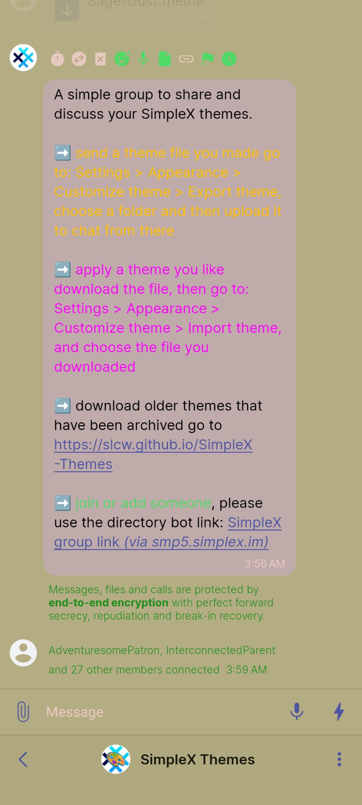
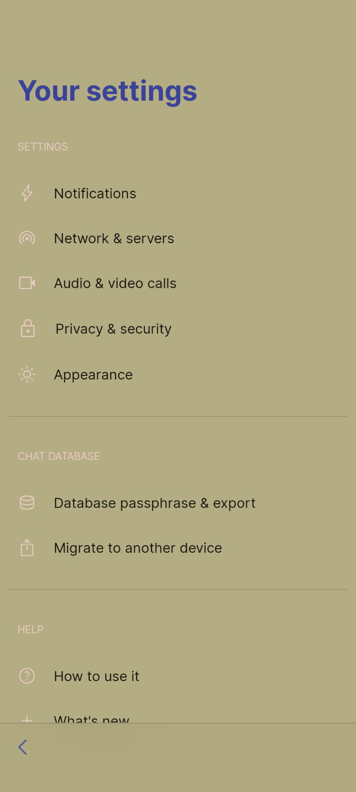
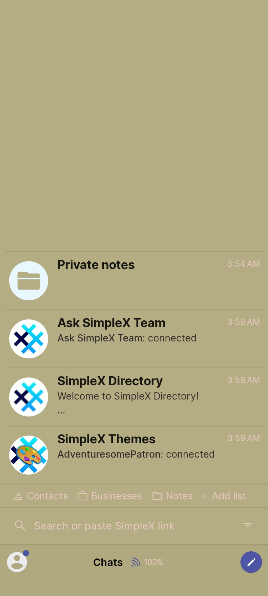
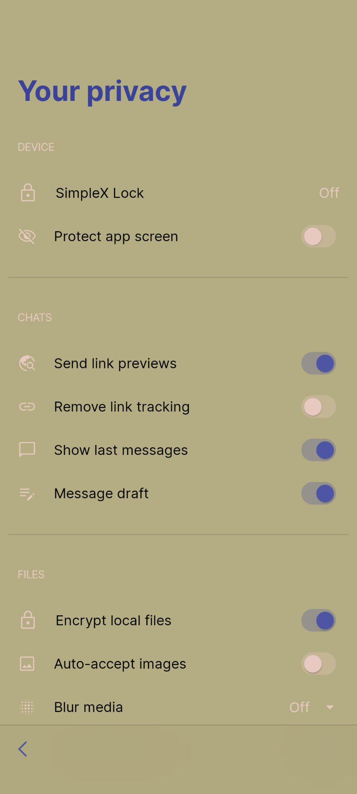

# Sage Dust

* Download [Sage Dust](../themes/SxC_Sage-Dust.theme)

<a href="../screenshots/SxC_Sage-Dust01.jpg" target="_blank">
	
</a>&nbsp;&nbsp;&nbsp;
<a href="../screenshots/SxC_Sage-Dust02.jpg" target="_blank">
	
</a>
<br>
<a href="../screenshots/SxC_Sage-Dust03.jpg" target="_blank">
	
</a>&nbsp;&nbsp;&nbsp;
<a href="../screenshots/SxC_Sage-Dust04.jpg" target="_blank">
	
</a>

----
### Theme Properties
```
base: "LIGHT"
colors:
  accent: "#ff4d55a4"
  accentVariant: "#ff384199"
  secondary: "#ffe8c9c1"
  secondaryVariant: "#fff1f2f6"
  background: "#ffb4ac82"
  menus: "#ffb4ac82"
  title: "#ff3a4399"
  accentVariant2: "#ffe9f7ff"
  sentMessage: "#ffb29d96"
  sentReply: "#ffb8a895"
  receivedMessage: "#ffc0abab"
  receivedReply: "#ff9b9ba9"
  ```

* [Return Home](../)
